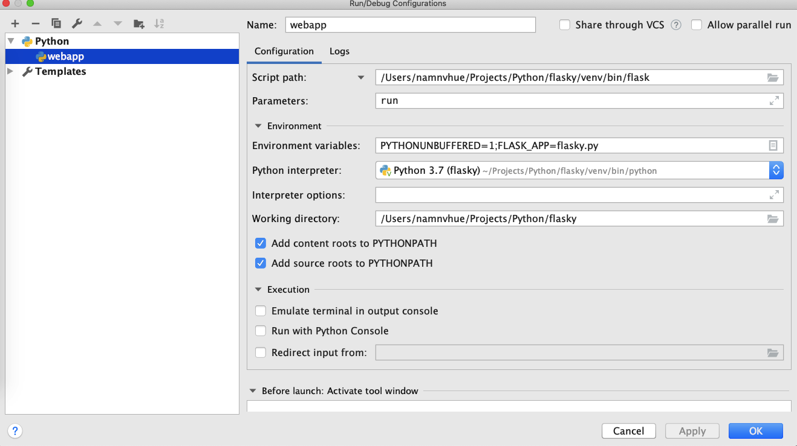
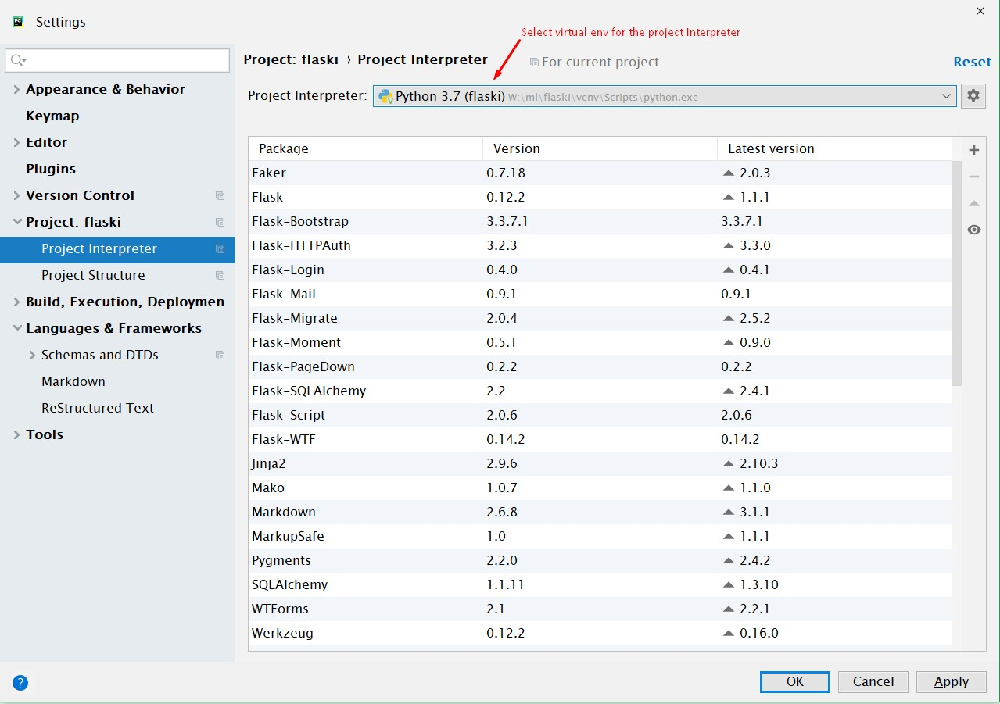
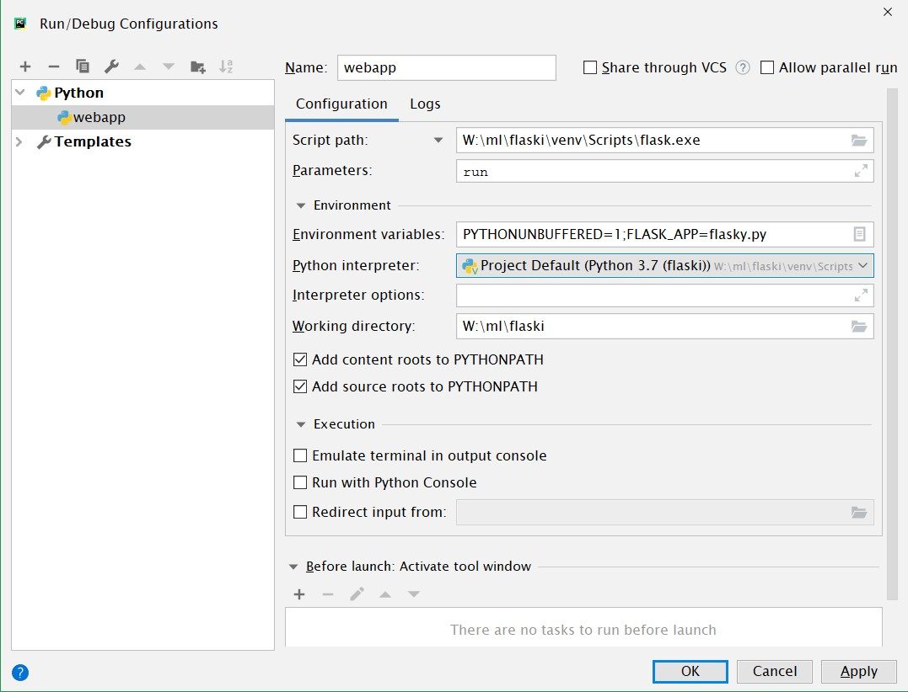

Flasky
======
### To build project on Linux / Mac
```bash
python3 -m venv venv
. venv/bin/activate
pip install -r requirements/dev.txt
export FLASK_APP=flasky.py
flask deploy
```

### To build project on Windows
```shell script
python -m venv venv 
.\venv\Scripts\activate.bat
pip install -r requirements\dev.txt
set FLASK_APP=flasky.py
flask deploy
```
#### Setup a VENV for PyCharm

#### Create a run configuration 
